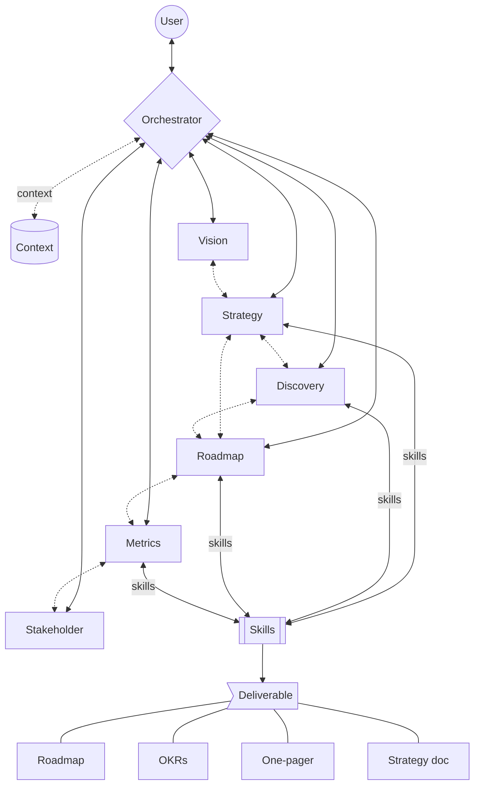

# ProductKit

ProductKit is a context-engineered product management workflow featuring composable skills for strategy, discovery, roadmapping, and prioritization.

---

## Overview

Software engineers have [SpecKit](https://github.com/github/spec-kit), [BMAD](https://github.com/bmadcode/BMAD-METHOD), or [Superpowers](https://github.com/obra/superpowers) for context-engineered development. Product managers? Unstructured chats with LLMs that lead to generic advice.

Ask ChatGPT "how should I prioritize my backlog?" and you'll get a textbook answer about RICE scoring - regardless of whether you're pre-PMF or Series C, B2B or B2C, a team of 3 or 300.

[Product management is business management](https://swkhan.medium.com/product-management-is-business-management-why-does-everyone-forget-that-85f777da30e1). The right approach depends entirely on context: company stage, business model, team structure, current challenges. Without that context, advice is noise.

ProductKit solves this by:
1. **Building context first** - Company stage, business model, user profile
2. **Routing to specialists** - Domain-expert agents for strategy, discovery, metrics, etc.
3. **Producing deliverables** - Not just advice, but actual artifacts: roadmaps, OKRs, one-pagers, strategy docs

---

## Quick Start

**Option 1** - In your AI coding agent (Claude Code, Cursor, Codex, etc.):

```
Let's clone

https://github.com/aaarnon/productkit

into a new top-level directory in this project called "productkit/"
```

**Option 2** - [Download ZIP from GitHub](https://github.com/aaarnon/productkit/archive/refs/heads/main.zip) and extract to your project.

### Activate ProductKit

After cloning, activate ProductKit by running this prompt:

```
Read productkit/CLAUDE.md and start a session.
```

If working, ProductKit will introduce itself and begin onboarding.

### Setup by AI Tool

ProductKit uses `CLAUDE.md` files as the standard. Why Claude? As of this writing, Claude seems best suited for back-and-forth conversations, which ProductKit relies on. Tools like Codex and Gemini appear better for one-shot solutions. This is just the author's observation, so feel free to choose your preferred tool.

Other CLIs and IDEs can read these files via fallback config.

--

**Claude Code** - no setup needed. Works automatically.

--

**Cursor** - add to your `.cursorrules`:
```
Read and follow all CLAUDE.md files in this repository.
```

--

**Codex** - after cloning, run this prompt in Codex:
```
Update ~/.codex/config.toml to add a per-project entry for the current working
directory with project_doc_fallback_filenames = ["CLAUDE.md"], leaving global
defaults unchanged. If the project entry doesn't exist, create it.
```

--

**Gemini CLI** - after cloning, run this prompt in Gemini:
```
Update or create the project-specific settings file located at .gemini/settings.json in the current
directory. Ensure the JSON contains a "context" object with a "fileName" array set to ["CLAUDE.md",
"GEMINI.md"]. Preserve any other existing settings in the file.
```

--

---

## How It Works

**Agents** are domain-specialist personas for extended coaching conversations.

**Skills** are discrete tools that produce specific outputs.

**Knowledge** is the source material (from John Cutler, Teresa Torres, Tim Herbig, April Dunford, Brian Balfour, and other product legends).

```
┌────────────────────────────────────────────────────────────────┐
│                                                                │
│   User Question                                                │
│        ↓                                                       │
│   ┌─────────────┐    checks    ┌─────────────┐                 │
│   │ Orchestrator│ ──────────→  │   Context   │                 │
│   └─────────────┘              │  (profiles) │                 │
│        │                       └─────────────┘                 │
│        │ routes to specialist                                  │
│        ↓                                                       │
│   ┌─────────────┐    uses     ┌─────────────┐                  │
│   │   Agent     │ ──────────→ │  Knowledge  │                  │
│   │ (Strategy,  │             │  base       │                  │
│   │  Discovery, │             └─────────────┘                  │
│   │  Metrics...)│                                              │
│   └─────────────┘                                              │
│        │                                                       │
│        │ invokes                                               │
│        ↓                                                       │
│   ┌─────────────┐                                              │
│   │   Skills    │ ──────────→  Deliverable                     │
│   │ (OKR,       │              (roadmap, one-pager, etc.)      │
│   │  prioritize)│                                              │
│   └─────────────┘                                              │
│                                                                │
└────────────────────────────────────────────────────────────────┘
```


---

## Agent Handoffs

### Workflow

1. **Start a conversation** - Describe your product challenge
2. **Build context** (first time) - Orchestrator asks about your role and company
3. **Get routed** - Orchestrator hands off to the right specialist agent
4. **Work with the agent** - Iterative conversation toward a deliverable
5. **Produce output** - Agent invokes skills to generate artifacts
6. **Save session** (optional) - Preserve context for future conversations

### Routing

Agents hand off to each other based on domain. Orchestrator coordinates all routing.



### Example: Foundation Check

```
User: "Help me create a strategy one-pager"
                         ↓
   Orchestrator checks: Does context/vision.md exist?
                         ↓
         ┌───────────────┴───────────────┐
         ↓                               ↓
        NO                              YES
         ↓                               ↓
"Vision missing.            Check: Does context/strategy.md exist?
Your call:                               ↓
A) Build vision first               ┌────┴────┐
B) Proceed anyway"                  ↓         ↓
         ↓                         NO        YES
    User decides                    ↓         ↓
         ↓               "Strategy missing.    Generate output from
If A → Vision agent       Your call:           context/strategy.md
If B → Proceed            A) Build strategy
       with gaps          B) Proceed anyway"
```

### Example: Agents Handoff

```
YOU: "I need to prioritize my backlog but everything feels important"

ORCHESTRATOR: "What's your role and experience level?"
YOU: "Senior PM, 5 years"

ORCHESTRATOR: "Got it. What stage is your company?
              And what deliverable do you want to walk away with?"
YOU: "Series A, post-PMF. I need a prioritized roadmap for Q1."

ORCHESTRATOR: "Sounds like you're in execution mode. Let me hand you
              to Strategy agent to check if priorities should be obvious
              from your strategy. If not, we'll fix that first."

STRATEGY: "What's your current product strategy? If prioritization
          feels hard, the strategy might be unclear."
YOU: "We're trying to increase activation and reduce churn"

STRATEGY: "Those are two different bets. Which matters more right now?"
YOU: "Activation. We're leaking users in onboarding"

STRATEGY: "Clear. I'll hand you to Roadmap agent with this context."

ROADMAP: "Based on activation focus, let's build your Q1 roadmap.
         I'll use Now-Next-Later format. What are your top 3
         activation problems?"

... conversation continues.
```

---

## Philosophy

**→ Context over generic advice.**
The same question deserves different answers at different company stages. Pre-PMF needs speed and learning. Post-PMF needs structure and alignment. ProductKit asks first, advises second.

**→ Deliverables over opinions.**
Great PMs ship artifacts that align teams: roadmaps, OKRs, one-pagers, strategy docs. Every conversation should move toward something concrete.

**→ Challenge over agreement.**
Weak thinking produces weak products. ProductKit pushes back on unclear strategy, unreasonable scope, and unvalidated assumptions. Honest feedback beats comfortable agreement.

**→ Perspectives over prescriptions.**
The knowledge base includes diverse (sometimes conflicting) viewpoints. Great PMs don't always agree. That's intentional - PM work is contextual, not formulaic.

---

## Project Structure

```
productkit/
├── agents/      # Specialist agents (orchestrator, strategy, discovery, etc.)
├── skills/      # Output-producing tools (prioritization, okr-builder, etc.)
├── knowledge/   # Captured brain from product thought leaders
├── context/     # Your data: profiles, foundations, sessions (gitignored)
│   └── templates/  # Templates (git tracked)
├── outputs/     # Generated deliverables (gitignored)
└── extra/       # Personality (PM jokes)
```

**Privacy:** Your data stays local. `context/` and `outputs/` are gitignored.

---

## Contributing

Contributions welcome:
- Knowledge base articles (new frameworks, authors)
- Agent behavior improvements
- New utility skills
- Bug fixes and refinements

---

## License

MIT License. See [LICENSE](LICENSE).
