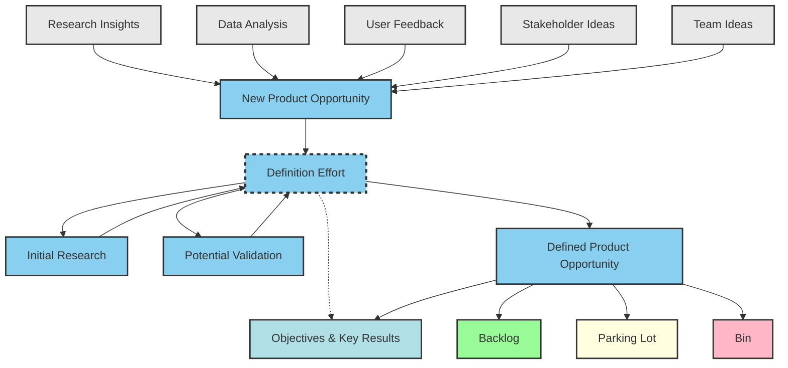

# High-Level Opportunities Backlog & Discovery Workflow

---

## Purpose

A high-level opportunities backlog captures and organizes potential product initiatives before conducting detailed discovery or business case activities.

**Function:** Repository for ideas, opportunities, and strategic initiatives that may contribute to roadmap and business goals.

---

## Benefits

| Benefit | Description |
|---------|-------------|
| **Single Source** | Centralized location to capture all potential ideas before full exploration |
| **Strategic Alignment** | Ensures initiatives align with strategic objectives and business goals |
| **Opportunity Assessment** | Systematic evaluation against market potential, feasibility, resources |
| **Resource Planning** | Visibility into future work for capacity planning |
| **Future Roadmap Development** | Pool of validated initiatives for roadmap |
| **Collaboration** | Transparent platform for cross-functional idea sharing |

---

## Functionality vs Capability

Understanding this distinction is crucial for opportunity framing:

| Aspect | Functionality | Capability |
|--------|--------------|------------|
| **Definition** | Specific features or actions a product can perform | Broader abilities encompassing multiple functionalities |
| **Focus** | Tied to specific use cases or tasks | Higher-level: what product enables users to achieve |
| **Example** | Text formatting, spell check, file export | "Enabling professional document creation" |
| **Granularity** | More specific (what product does) | Higher-level (what product enables) |
| **Perspective** | How product works | Value it provides |

---

## Discovery & Validation Workflow

### 1. Input Sources

Multiple discovery channels feed product opportunities:

| Source | Examples |
|--------|----------|
| **Research Insights** | Market research, competitive analysis, trend analysis |
| **Data Analysis** | Usage metrics, analytics, behavioral patterns |
| **User Feedback** | Customer input, support tickets, feature requests |
| **Stakeholder Ideas** | Leadership and business suggestions |
| **Team Ideas** | Internal product and engineering innovations |

---

### 2. Discovery & Definition Process

```
Input Sources
    ↓
New Product Opportunity
    ↓
Definition Effort (gating process)
    ├── Initial Research (desk research, market sizing, technical feasibility)
    └── Potential Validation (user interviews, prototypes, experiments)
    ↓
Defined Product Opportunity
    ↓
[Backlog | Parking Lot | Bin]
    ↑
OKRs (strategic alignment layer)
```

#### a) New Product Opportunity
- All input sources funnel into potential opportunities
- Raw ideas consolidated and initially scoped

#### b) Definition Effort (Central Gating)
Core validation process with two parallel sub-processes:

- **Initial Research** — Desk research, market sizing, technical feasibility
- **Potential Validation** — User interviews, prototypes, experiments

#### c) Defined Product Opportunity
- Validated opportunities with clear problem-solution fit
- Includes: business case, user needs, success metrics

#### d) Objectives & Key Results (Strategic Layer)
- All opportunities and definition work tie back to company OKRs
- Ensures focus on highest-impact initiatives

---

### 3. Prioritization Outcomes

Defined opportunities triaged into three buckets:

| Bucket | Color | Meaning |
|--------|-------|---------|
| **Backlog** | 🟢 Green | Approved for roadmap, ready for sprint planning |
| **Parking Lot** | 🟡 Yellow | Good ideas, not current priority, revisit later |
| **Bin** | 🔴 Red | Rejected, doesn't align or solve validated need |

---

## Key Workflow Characteristics

1. **Continuous Input** — Discovery is always-on from multiple sources
2. **Gated Definition** — All opportunities must pass through research + validation
3. **Strategic Alignment** — OKRs provide top-down guidance
4. **Clear Triaging** — Explicit outcomes (build, defer, or kill)

---

## Workflow Diagram



---

## Summary

### Process Flow
```
[5 Input Sources]
    → New Product Opportunity
    → Definition Effort (Research + Validation)
    → Defined Product Opportunity
    → [Backlog | Parking Lot | Bin]

(All aligned to Objectives & Key Results)
```

### Key Takeaways

1. **Always-on discovery** — Multiple input channels continuously feed opportunities
2. **Gated validation** — Definition effort ensures quality before prioritization
3. **Strategic filter** — OKRs ensure only high-impact work progresses
4. **Clear outcomes** — Three-bucket system (build, defer, reject)
5. **Capability thinking** — Frame opportunities by user outcomes, not just features
